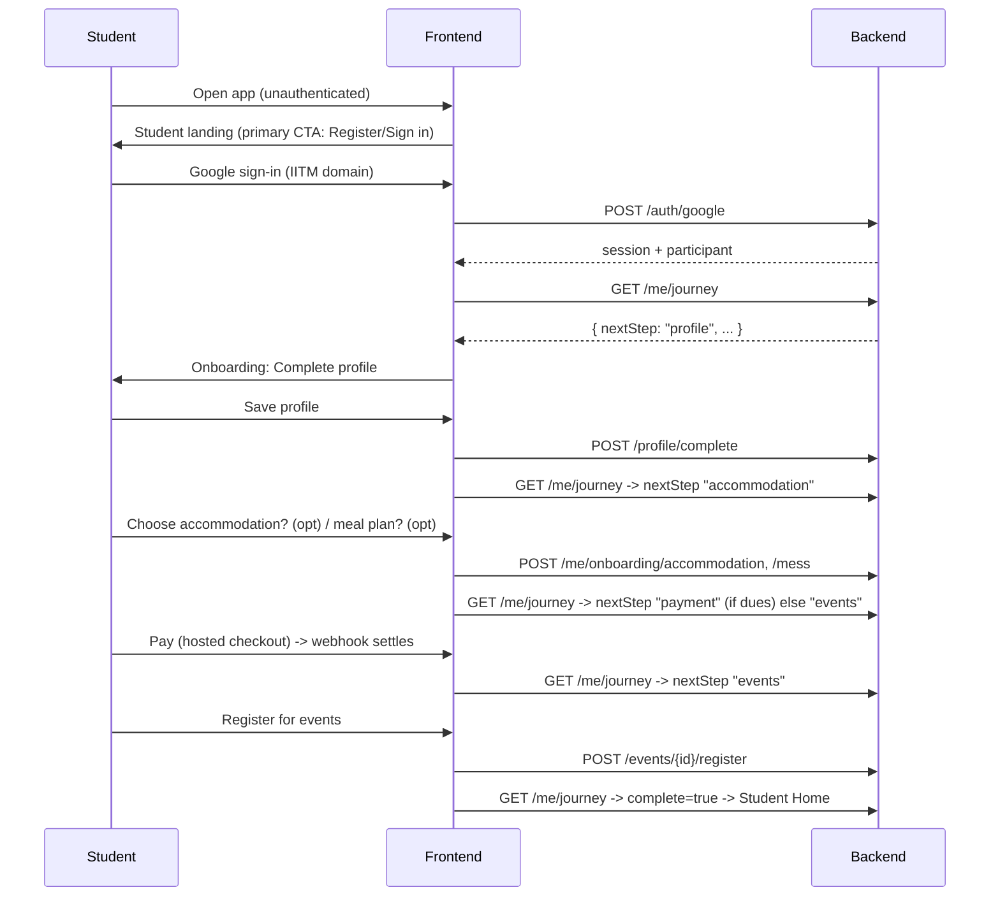
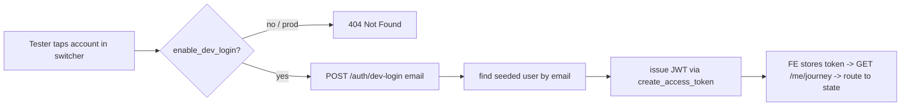

# Design Document

## Overview

This design reorients Paradox Connect around a single student journey and adds a
test-account harness, building on the existing modules rather than replacing
them. Auth (Google Sign-in), profile, events, mess, hostel, payments (mock
gateway), announcements, attendance, and the on-device QR all remain the source
of truth. We add three things:

1. A **journey/onboarding layer** — a derived, server-computed view of "where is
   this student in the pipeline and what's next" (Req 2, 3), plus small pieces of
   persisted *intent* (does the student want accommodation / a meal plan).
2. **Participant-side event registration** — a new `event_registrations` usage
   (the collection already exists but is unused) with register/cancel/list and
   capacity handling (Req 7).
3. A **test harness** — an idempotent seed script covering every state in Req 10
   and a **dev-only login** endpoint + a frontend **account switcher**, strictly
   gated off in production.

The frontend gains a student-first entry, a guided onboarding pipeline, a
reworked student home, event registration UI, a passes view, and the dev
switcher — all reusing the existing design system (shell, `AdminScreen`,
primitives) and the mock/real API boundary.

Design principle (Req 3, 13): the journey is **derived**, never a parallel copy.
The only new persisted fields are explicit intent choices; everything else
(profileComplete, allocations, payments, mess eligibility, registrations) is read
from the modules that already own it.

## Architecture

### Current state (relevant pieces)

- **Backend**: FastAPI, MongoDB (`AsyncMongoClient`), JWT sessions, per-module
  routers under `/api/v1`. Collections include `users`, `events`,
  `event_registrations` (created, unused), `hostel_allocations`, `mess_menu`,
  `meal_plans`, `payments`, `announcements`, `scan_logs`.
- **Frontend**: React 19 + Vite + Tailwind v4 PWA. All network access goes
  through a swappable `ApiClient` (`mockApi` / `realApi`); the real client maps
  backend snake_case → app camelCase. Route-split pages; `AppShell` (student) and
  `AdminScreen` (management) layouts.

### Added building blocks

```
Backend
  app/journey/              # derived onboarding state
    routes.py  service.py  schemas.py
  app/registrations/        # participant-side event registration
    routes.py  service.py  schemas.py
  app/auth/dev_login.py     # dev-only login (gated), wired into auth routes
  app/onboarding fields on the user doc: { onboarding: { accommodation_choice,
                             mess_choice, mess_plan_id } }
  scripts/seed_test_data.py # idempotent seed of Req-10 accounts + supporting data

Frontend
  src/features/journey/     # useJourney hook, step model, guards
  src/pages/onboarding/     # OnboardingLayout + per-step screens
  src/pages/EventDetailPage # + register/cancel
  src/pages/PassesPage      # QR + per-event tickets
  src/features/devtools/    # AccountSwitcher (dev only)
  api additions in ApiClient / realApi / mockApi / types
```

### End-to-end flow (happy path)



## Data Models

### User document — additive `onboarding` field

Only *intent* is stored; status is derived. No existing field is repurposed.

```jsonc
// users (additive)
"onboarding": {
  "accommodation_choice": "yes" | "no" | null,  // null = not yet decided
  "mess_choice": "yes" | "no" | null,
  "mess_plan_id": "<objectId string>" | null
}
```

### Event registrations (existing collection, now used)

```jsonc
// event_registrations  (unique index uq (user_id, event_id) already exists)
{
  "_id": ObjectId,
  "user_id": ObjectId,
  "event_id": "<objectId string>",
  "status": "registered" | "cancelled",
  "created_at": ISODate,
  "updated_at": ISODate
}
```

### Journey (derived, never stored)

Computed by `app/journey/service.py` from: `users.profile_complete`,
`users.onboarding`, `hostel_allocations`, `payments` (latest hostel/mess),
`users.access.mess_eligible`, and `event_registrations` count.

```jsonc
// GET /me/journey  (backend snake_case; adapter → camelCase)
{
  "profile_complete": true,
  "accommodation": { "choice": "yes", "allocated": false, "paid": false },
  "mess":          { "choice": "yes", "plan_id": "…", "paid": false },
  "payment_due": true,             // any chosen-but-unpaid booking
  "events_registered": 0,
  "steps": [                       // ordered, for the progress UI (Req 2.6)
    { "key": "profile",       "state": "done" },
    { "key": "accommodation", "state": "done" },      // decided
    { "key": "mess",          "state": "done" },
    { "key": "payment",       "state": "current" },   // done|current|upcoming|skipped
    { "key": "events",        "state": "upcoming" }
  ],
  "next_step": "payment",          // profile|accommodation|mess|payment|events|done
  "complete": false
}
```

**`next_step` resolution (Req 2.1, 2.2, 2.7):**
1. `profile` if `!profile_complete`.
2. `accommodation` if `accommodation_choice == null`.
3. `mess` if `mess_choice == null`.
4. `payment` if `payment_due` (a chosen accommodation/mess is unpaid).
5. `events` if `events_registered == 0` (a soft prompt; students may skip and
   still reach home).
6. `done` otherwise. `complete = next_step in {events, done}` — reaching the
   events step means mandatory onboarding is satisfied; the home is unlocked and
   the pipeline is never force-shown again (Req 2.8).

## Components and Interfaces

### Backend API additions (all under `/api/v1`)

| Method & path | Auth | Purpose | Reqs |
|---|---|---|---|
| `GET /me/journey` | student | Derived onboarding state | 2,3,8 |
| `POST /me/onboarding/accommodation` `{ choice: "yes"\|"no" }` | student | Record accommodation intent; on "yes" create a pending hostel-fee payment intent | 4 |
| `POST /me/onboarding/mess` `{ choice, plan_id? }` | student | Record mess intent + selected plan | 5 |
| `GET /me/payments/pending` | student | Items chosen but unpaid (for the payment step summary) | 6 |
| `POST /events/{id}/register` | student | Register (capacity-checked); idempotent | 7 |
| `DELETE /events/{id}/register` | student | Cancel registration | 7 |
| `GET /me/registrations` | student | My registered events (with event details) | 7,8 |
| `POST /auth/dev-login` `{ email }` | dev-only | Issue a session for a seeded account (no Google) | 10 |
| `GET /auth/test-accounts` | dev-only | List seeded accounts for the switcher | 10 |

Existing endpoints reused unchanged: `/auth/google`, `/profile/complete`,
`/mess/*`, `/hostel/*`, `/payments/*`, `/events` (list/detail get two extra
read-only fields below), `/announcements`, `/qr/*`, `/scan/verify`.

**Events list/detail additions (read-only, per caller):** `registered: bool`,
`registration_count: int`, `spots_left: int` so the participant UI can show
registered/full state without a second call (Req 7.1, 7.3, 7.4). Attendance
(scan-based) remains separate from registration count.

### Accommodation/mess intent → payment (Req 4, 5, 6)

- **Accommodation "yes"** sets `onboarding.accommodation_choice="yes"` and ensures
  a `payments` record of `kind="hostel"` in `created` state exists (the fee is
  fixed, `HOSTEL_FEE_AMOUNT`). The actual block/room is still assigned by an
  admin (existing hostel module); the home shows "allocation pending" until then
  (Req 4.2, 4.3, 4.5). Paying settles `access.hostel_paid` via the existing
  webhook path.
- **Mess "yes"** sets `mess_choice="yes"` + `mess_plan_id`; the payment step uses
  the existing `POST /payments/mess/checkout { plan_id }`. Settlement grants the
  mess pass (existing behavior).
- The **payment step** lists pending items from `GET /me/payments/pending` and
  launches the existing hosted checkout per item; `payment_due` becomes false
  when none remain, advancing the journey.

### Event registration service (Req 7)

- Register: reject if event not published (404), already registered (idempotent
  200/409), or `registration_count >= capacity` (409 `event_full`). Uses the
  unique `(user_id, event_id)` index to prevent duplicates.
- Cancel: set `status="cancelled"` (soft) so history/audit is retained; frees a
  spot (count only rows with `status="registered"`).
- Event pass: reuses the on-device QR (checkpoint `event`); the event detail and
  Passes view show "Registered — show your QR at entry". No separate ticket
  secret is introduced (keeps the QR/TOTP model intact, Req 12.1).

### Dev login + test harness (Req 10) — security-critical



- **Gating:** a new setting `enable_dev_login = (APP_ENV != "production") and
  ENABLE_DEV_LOGIN == "true"`. Both `dev-login` and `test-accounts` return 404
  when disabled (Req 10.4). Default off; the seed script prints a reminder to
  enable it only in dev.
- **Seed script** `scripts/seed_test_data.py` (idempotent upsert by email) creates
  the Req-10 matrix using allowed IITM domains, e.g.:

  | Account (email local part) | Role | State |
  |---|---|---|
  | `newbie` | participant | signed in, no profile |
  | `profileonly` | participant | profile done, no bookings |
  | `hosteler` | participant | accommodation booked + paid + allocated |
  | `hostelunpaid` | participant | accommodation chosen, payment pending |
  | `messie` | participant | mess plan booked + paid (pass active) |
  | `fullstack` | participant | profile + hostel + mess + events, all paid |
  | `eventfan` | participant | registered for several events |
  | `paidpending` | participant | one paid + one pending payment |
  | `volunteer` | organizer | scanner access |
  | `warden` | admin | admin surfaces |
  (Super Admins already seeded separately.)

  Each account's supporting rows (hostel_allocations, payments, mess eligibility,
  event_registrations, onboarding intent) are written consistently (Req 10.2).
- **Frontend switcher** (`src/features/devtools/AccountSwitcher.tsx`): a
  dev-only floating panel, rendered only when `env.enableDevSwitcher`. It calls
  `GET /auth/test-accounts`, lists them grouped by state, and on tap calls
  `devLogin(email)` → stores the token → reloads journey → routes. In **mock
  mode** it switches the mock's `currentId` directly (no network). Never rendered
  in production builds (Req 10.4).

### Frontend structure

**Routing / entry (Req 1, 11):**
- `/` → student landing (primary CTA sign in). Organizer/Admin entry demoted to a
  secondary link. `postLoginRoute` becomes journey-driven: fetch `/me/journey`,
  route to `/onboarding` (nextStep) or `/app` (home) or the role surface.
- `/onboarding` → `OnboardingLayout` renders the current step from the journey
  (`ProfileStep` reuses CompleteProfile, `AccommodationStep`, `MessStep`,
  `PaymentStep`, `EventsStep`) with a progress header (Req 2.6). Guards redirect
  to the correct step if a student deep-links out of order (Req 2.2).

**Student shell nav (refined, 5 tabs, Req 8.3):** Home · Events · My Pass · More
· Profile. "More" groups mess/hostel/payments/help/announcements so primary
student actions stay thumb-reachable. Organizer/admin management stays under the
home "Manage" hub + `AdminScreen`.

**Student Home (Req 8):** sections — Continue setup (only while incomplete,
deep-links nextStep) · My events · My pass (QR shortcut) · Bookings & payment
status · Announcements (with unread indicator) · quick links. Every section has
loading/empty/error/success states.

**API client additions** (mirrored in `ApiClient`, `realApi` with snake↔camel
mapping, and `mockApi`): `getJourney`, `setAccommodationChoice`, `setMessChoice`,
`getPendingPayments`, `registerEvent`, `cancelEventRegistration`,
`listMyRegistrations`, `devLogin`, `listTestAccounts`. Types added to
`api/types.ts` (`Journey`, `JourneyStep`, `EventRegistration`, `PendingPaymentItem`,
`TestAccount`).

## Error Handling

- **Journey load failure (Req 3.4):** the home and onboarding show a recoverable
  `ErrorState` with retry; never a blank screen.
- **Event registration:** `event_full` → disable the register action and show a
  "Full" badge; `already_registered` treated as success (idempotent);
  `event_not_found`/unpublished → 404 surfaced as a friendly message.
- **Payment:** unchanged from the payments module — failed/abandoned leaves items
  unpaid and retryable; no duplicate bookings (Req 6.4). The payment step re-reads
  `GET /me/payments/pending` after returning from checkout.
- **Dev login disabled:** switcher hidden; endpoints 404. If a stale switcher
  calls it, the 404 is handled quietly.
- **Ordering guards:** deep-linking to a later onboarding step when an earlier one
  is incomplete redirects to `next_step` (Req 2.2).
- All new endpoints follow the existing `ApiError` envelope (`code`, `message`)
  and map `PyMongoError` → 503 `database_unavailable`.

## Testing Strategy

- **Backend unit (fakes, existing pattern):** journey `next_step` resolution
  across the state matrix; event registration capacity/duplicate/cancel;
  dev-login gating (404 when disabled, JWT when enabled); accommodation/mess
  intent → pending-payment derivation. Preserve the current 7 auth tests.
- **Backend live smoke (Atlas, disposable + cleanup, as in prior epics):** run the
  full pipeline for a disposable user — profile → accommodation intent → mess plan
  → pay (mock settle) → register events → journey `complete` — then delete.
- **Seed script:** run against Atlas, verify each account resolves to its intended
  journey state, and document reset/re-seed (Req 10.6). Guard: seed uses a
  recognizable naming scheme so `scripts` can also purge test data.
- **Frontend:** keep the 35 tests green. Add tests for the journey step machine
  (pure function), the onboarding guard/routing, and event register/cancel on the
  mock. The account switcher is dev-only and excluded from production bundles.
- **Verification gates (unchanged):** frontend typecheck + lint (0 errors) +
  vitest + build; backend pytest. Live smokes clean up all created data.

## Correctness Properties

Invariants the implementation must uphold (targets for tests and review):

### Property 1: Journey is a pure function of module data + intent
Given the same `users` record, allocations, payments, mess eligibility, and
registration count, `GET /me/journey` always yields the same
`next_step`/`complete`. No hidden onboarding table can disagree with the modules.

**Validates: Requirements 3.1, 3.3**

### Property 2: payment_due iff an unpaid chosen booking
`payment_due` is true if and only if (`accommodation_choice == "yes"` and hostel
not paid) or (`mess_choice == "yes"` and mess not paid).

**Validates: Requirements 2.7, 6.1**

### Property 3: Onboarding never regresses once unlocked
After `complete` becomes true, later visits route to the home; the pipeline is
never force-shown again. Home remains reachable regardless of optional-step
choices.

**Validates: Requirements 2.8, 2.5**

### Property 4: At most one active registration per (student, event)
Enforced by the unique index; re-registering is idempotent, and a cancelled row
is re-activated rather than duplicated.

**Validates: Requirements 7.2, 7.5**

### Property 5: Capacity is never exceeded via registration
A register succeeds only while `registration_count < capacity`; overflow is
rejected with `event_full`.

**Validates: Requirements 7.4**

### Property 6: Payments are idempotent and never duplicate bookings
A replayed paid webhook does not double-apply; a failed/abandoned payment leaves
the booking unpaid and retryable.

**Validates: Requirements 6.3, 6.4**

### Property 7: Intent never fabricates authoritative records
Expressing accommodation intent creates only a payment intent + a flag; it never
invents a hostel block/room — allocation remains admin-authored.

**Validates: Requirements 4.2, 13.1**

### Property 8: Dev login is unreachable in production
When `enable_dev_login` is false, `/auth/dev-login` and `/auth/test-accounts`
return 404 and the switcher is not rendered.

**Validates: Requirements 10.4**

### Property 9: Server-side RBAC unchanged
New UI routing/entry grants no capability; every privileged action is still
authorized on the backend.

**Validates: Requirements 1.5, 13.4**

## Key Decisions & Trade-offs

1. **Derived journey, minimal new state (Req 3, 13).** Avoids a parallel
   onboarding table that could drift from the modules. Only intent
   (`accommodation_choice`, `mess_choice`, `mess_plan_id`) is persisted.
2. **Accommodation stays admin-allocated; students express intent + pay.** Keeps
   the existing hostel module authoritative for block/room while giving students
   a booking action; "allocation pending" bridges the two (Req 4).
3. **Event pass = existing QR, not a new secret.** Preserves the audited TOTP
   model and offline behavior (Req 9.1, 12.1) instead of minting per-event
   secrets.
4. **Dev login over fake Google tokens.** A gated, first-class dev endpoint is
   safer and clearer than mocking Google server-side, and is impossible to reach
   in production (Req 10.4).
5. **Reference (techfest.org) informs IA only.** Journey spine, event
   presentation, and nav hierarchy are adapted to a mobile-first PWA; no visual
   cloning.

## Requirements Coverage

| Requirement | Addressed by |
|---|---|
| 1 Student-first entry | Routing/entry, journey-driven `postLoginRoute` |
| 2 Guided pipeline | `OnboardingLayout` + steps, `next_step` resolution |
| 3 Progress/status model | Derived `GET /me/journey`, error handling |
| 4 Accommodation | Intent endpoint + hostel module + pending payment |
| 5 Mess | Intent endpoint + meal plans + mess checkout |
| 6 Payment | Pending-items summary + existing hosted checkout |
| 7 Event registration | `registrations` service + events read fields + UI |
| 8 Student home | Reworked Home sections + nav |
| 9 Passes/notifications/schedule | Passes view (QR + tickets), announcements, schedule |
| 10 Test harness | Seed script + gated dev-login + account switcher |
| 11 Coherent journey | Step→next-action linking, guards, role routing |
| 12 PWA quality | Reuse design system, states, code-split, offline QR |
| 13 Backward compatibility | Additive state, mock/real boundary, server RBAC |
